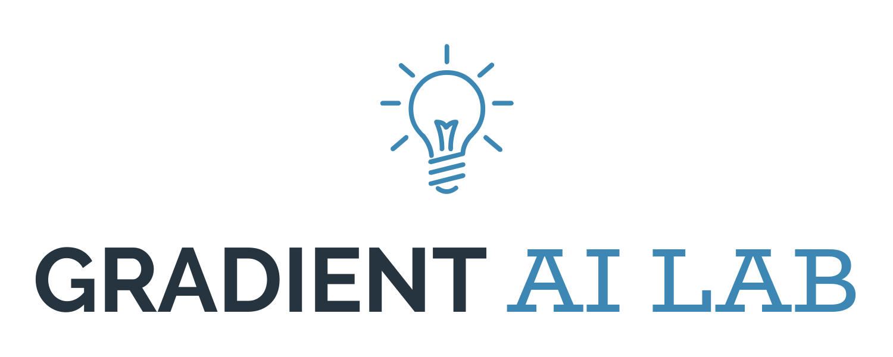

<p align="center"></p>

---

## What is it all about?

&nbsp;&nbsp;&nbsp;&nbsp;In this project we want to explore reinforcement learning techniques in deep learning. Our baseline is experiment presented by Andrej Karpathy on his [blog](http://karpathy.github.io/2016/05/31/rl/). You can find his post in `pg_pong/etc` directory. It's about lightweight Policy Gradient agent.  
&nbsp;&nbsp;&nbsp;&nbsp;Starting from reproduction of his work, we now go further developing better agents for reinforcement learning tasks we find interesting. Eventually, we will start whole new projects based on gained experience.  
Along the road, articles/presentations for Gradient research circle and further should emerge.

Do you have your own project/idea or want to join one of our projects? **[Contact us now](#contact-us-now)!** Do you want to start working on AI? [Read further](#how-to-start-ai&rl-journey).

## How to start AI&RL journey?

&nbsp;&nbsp;&nbsp;&nbsp;Do you want to start to work with Artificial Intelligence? Don't be scared! You just need some basic programming skills and great desire to learn and create incredible things :) We will find some tailor-made task for you. **[Contact us now](#contact-us-now)!**

### Here you have some theoretical materials about DRL and ANNs to start with:

0. Of course some background in Artificial Neural Networks:
    * [Great introduction to theory behind Neural Networks from 3Blue1Brown](https://www.youtube.com/playlist?list=PLZHQObOWTQDNU6R1_67000Dx_ZCJB-3pi)
    * Fantastic classes about "Convolutional Neural Networks for Visual Recognition":
        * [Lectures videos](https://www.youtube.com/playlist?list=PLkt2uSq6rBVctENoVBg1TpCC7OQi31AlC)
        * [Notes, assignments etc.](http://cs231n.github.io/)
1. Artificial Intelligence grounding:
    * Berkeley cs188 course ([on edXedge](https://edge.edx.org/courses/course-v1%3ABerkeley%2BCS188%2BSP17/)):
        * [Uncertainty and Utilities](https://www.youtube.com/watch?time_continue=15&v=GevK0-9n24g)
        * [MDP part I](https://www.youtube.com/watch?v=Oxqwwnm_x0s&t=4034s) and [MDP part II](https://www.youtube.com/watch?v=6pBvbLyn6fE&t=847s)
        * [Reinforcement Learning part I](https://www.youtube.com/watch?v=IXuHxkpO5E8) and [Reinforcement Learning part II](https://www.youtube.com/watch?v=yNeSFbE1jdY)
    * Book [Artificial Intelligence: A Modern Approach (3rd Edition)](https://dcs.abu.edu.ng/staff/abdulrahim-abdulrazaq/courses/cosc208/Artificial%20Intelligence%20A%20Modern%20Approach%20(3rd%20Edition).pdf):
        * Ch. 16.1 - 16.3
        * Ch. 17.1 - 17.3
        * Ch. 21
2. Deep Reinforcement Learning:
    * Book [Reinforcement Learning: An Introduction (2nd Edition Draft)](http://ufal.mff.cuni.cz/~straka/courses/npfl114/2016/sutton-bookdraft2016sep.pdf)
    * Courses (personally I consider watching and doing assignments from Deep RL Bootcamp as a good start):
        * [Deep RL Bootcamp](https://sites.google.com/view/deep-rl-bootcamp/home)
        * [Reinforcement Learning Summer School](http://videolectures.net/deeplearning2017_montreal/)
        * [CS 294: Deep Reinforcement Learning](http://rll.berkeley.edu/deeprlcourse/)

## Repository organization

### _(Preferred)_ Directory tree

```
.
├── README.md (This file. Organization, targets, tasks, descritptions etc.)
├── etc (Other resources related to reinforcement learning in general e.g. papers)
└── <project name> 
    ├── README.md (Project description, organization, milestones etc.)
    ├── doc (Articles, presentations, experiments descriptions and results etc.)
    ├── etc (Other resources related to project e.g. papers, diagrams etc.)
    └── src (All experiments live here.)
        ├── checkpoints (Saved models etc.)
        ├── codebase    (Classes, helpers, utils etc.)
        ├── logs        (All the logging related files.)
        ├── out         (All side products of scripts that don't fit anywhere else.)
        ├── third_party (As `codebase` + scripts but from third party.)
        └── script1.py  (All scripts performing experiments live in `src`.)

```

### _(Not only)_ Coding standards

* **README**

    Each project has to have it's own README. Here you can find how to write one:
    * https://open-source-guide.18f.gov/making-readmes-readable/
    * https://gist.github.com/PurpleBooth/109311bb0361f32d87a2

* **Python**

    [PEP 8 -- Style Guide for Python Code](https://www.python.org/dev/peps/pep-0008/) is in operation.
    
    If you are emacs user, I recommend installing this package: py-autopep8. Configuration:  
    ```elisp
    ;; enable autopep8 formatting on save
    (require 'py-autopep8)
    (add-hook 'elpy-mode-hook 'py-autopep8-enable-on-save)
    ```  
    If you look for the best python/markdown/everything IDE and want to configure it easily, here is a guide for you: https://realpython.com/blog/python/emacs-the-best-python-editor/ and then http://jblevins.org/projects/markdown-mode/ .

* **Git commits**

    * [How to Write a Git Commit Message](https://chris.beams.io/posts/git-commit/) is in operation.

    * If you want to contribute to this repo: fork it, work on your project and then create a pull request. **Pull request is mandatory even for collaborators!**

    * Commit name should start with capitalize project tag `[PROJECT]`. For now we have following tags:
        * [ORG] - "Organization" project e.g. change in this README.
        * [PG_PONG] - "Policy Gradient Pong" project based on Karpathy's blog post.
        * [Q_LEARN] - "Introduction to TD-Learning and Q-Learning algorithm" project.

    * If you work in this repo, remote branch names should follow those templates:

        * Dev branches: `dev/<project tag>/<user name>/<your branch name>`
        * Project branches: `proj/<project tag>/<branch name e.g. master>`

        Project branches will be merged to origin/master each milestone.

## Directions to explore

* [X] Stochastic Policy Gradients:

    Reading:  
    * [Deep Reinforcement Learning: Pong from Pixels](http://karpathy.github.io/2016/05/31/rl/)

* [ ] Continuous control of roboarm and/or hovering rocket:

    Reading about continuous control:  
    * [Asynchronous Methods for Deep Reinforcement Learning](https://arxiv.org/abs/1602.01783v2)
    * [High-Dimensional Continuous Control Using Generalized Advantage Estimation](https://arxiv.org/abs/1506.02438)
    * [Continuous control with deep reinforcement learning](https://arxiv.org/abs/1509.02971)
    
    Reading about learning robots:  
    * [Asymmetric Actor Critic for Image-Based Robot Learning](https://arxiv.org/abs/1710.06542)
    * [One-Shot Imitation Learning](https://arxiv.org/abs/1703.07326)
    * [Domain Randomization for Transferring Deep Neural Networks from Simulation to the Real World](https://arxiv.org/abs/1703.06907)
    * [Sim-to-Real Transfer of Robotic Control with Dynamics Randomization](https://arxiv.org/abs/1710.06537)

* [ ] Learning from Human Preferences:  
    
    Reading:
    * [OpenAI Blog: Learning from Human Preferences](https://blog.openai.com/deep-reinforcement-learning-from-human-preferences/)
    * [Learning from Human Preferences](https://arxiv.org/abs/1706.03741v3)
      
* [ ] Planning and reasoning about the future:

    Reading about imagination augmentation:  
    * [Agents that imagine and plan](https://deepmind.com/blog/agents-imagine-and-plan/)
    * [Learning model-based planning from scratch](https://arxiv.org/pdf/1707.06170.pdf)
    * [Imagination-Augmented Agents for Deep Reinforcement Learning](https://arxiv.org/pdf/1707.06203.pdf)

    Reading about "Schema Networks":  
    * [General Game Playing with Schema Networks](https://www.vicarious.com/general-game-playing-with-schema-networks.html)
    * [Schema Networks: Zero-shot Transfer with a Generative Causal Model of Intuitive Physics](https://arxiv.org/abs/1706.04317)

* [ ] Robofish in simulated aquarium:

    Reading:  
    * [Terrain-Adaptive Locomotion Skills Using Deep Reinforcement Learning](https://www.cs.ubc.ca/~van/papers/2016-TOG-deepRL/index.html)
    
# Contact us now
## Administrator:
Piotr Januszewski
piojanuszewski@gmail.com

---

_This is Gradient research circle project. Our website: http://gradient.eti.pg.gda.pl/_  
_The truth is, we will send fully automated "Prometeusz" space cruise to the Solaris in colonization mission! Maybe.._
